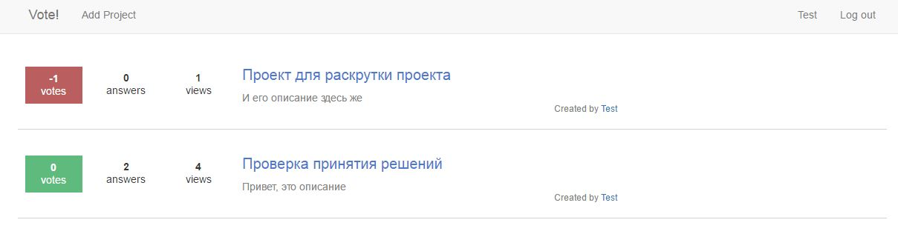
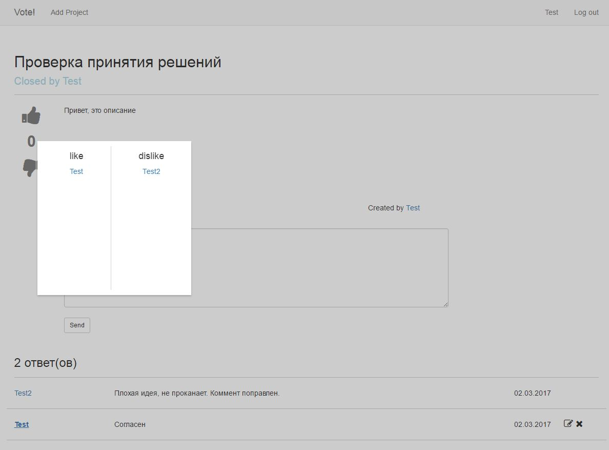

# Free Project Manager
<br>
A simple web-application for project publishing and voting for them.<br><br>
<a href="http://atspot.org/br-projects">Demo</a><br>

### Functionalities:
- Users can create, vote and browse projects. Also they can write comments.
- Privileged users can do the same and make desicions on projects, decline or accept them.

<br>
<br>


### Deploy on CentOS 

- In order your application works correctly, you should to install above packages:
```
$ yum install httpd 
$ yum install php
$ yum install mariadb mariadb-server
$ yum install mysql-connector-python
```
- Make sure that Python 2.7 is installed.
- Configure the Apache virtual server:
Create a file <code>servername.conf</code> in folder <code>/etc/httpd/conf.d/</code> with the following content:
```
<VirtualHost *:80>
ServerName localhost
ServerAlias localhost
DocumentRoot /var/www/html

<Directory /var/www/cgi-bin/>
 Options +ExecCGI
 AddHandler cgi-script .py
 Options FollowSymLinks
 AllowOverride All
 Require all granted
</Directory>
...
<Directory /var/www/html>
Options FollowSymLinks
 AllowOverride All
 Require all granted
 </Directory>
 ErrorLog /var/log/httpd/pm-error.log
 CustomLog /var/log/httpd/pm-access.log combined
</VirtualHost>
```
- Create a database and a user in MariaDB:
```
CREATE database database_name;
CREATE USER 'database_user'@'localhost' IDENTIFIED BY 'database_password';
GRANT SELECT,INSERT,UPDATE,DELETE on database_name.* to 'database_user'@'localhost';
```
- Create tables:
```
USE database_name;
CREATE table userTable (id int AUTO_INCREMENT primary key NOT NULL, 
    username varchar(40), 
    login varchar(60), 
    password varchar (255), 
    session varchar(255), 
    priveleges int(5),
    ip varchar(15)) 
    DEFAULT CHARACTER SET utf8 COLLATE utf8_bin;

CREATE table projects (id int AUTO_INCREMENT primary key NOT NULL, 
    name varchar(40), 
    description LONGTEXT, 
    author varchar (255), 
    solved int(1), 
    createTime TIMESTAMP(6),
    ip varchar(15),
    judgeLogin varchar(255),
    judgeName varchar(255)) 
    DEFAULT CHARACTER SET utf8 COLLATE utf8_bin;

CREATE table comments (id int AUTO_INCREMENT primary key NOT NULL,
    projectId int(255), 
    author varchar(40),
    login varchar(255), 
    comment LONGTEXT, 
    createTime TIMESTAMP(6),
    ip varchar(15)) 
    DEFAULT CHARACTER SET utf8 COLLATE utf8_bin;

CREATE table rating (id int AUTO_INCREMENT primary key NOT NULL,
    login varchar(40),
    username varchar(40),
    projectId int(255),
    vote int(1))
    DEFAULT CHARACTER SET utf8 COLLATE utf8_bin; 

CREATE table watch (id int AUTO_INCREMENT primary key NOT NULL,
    login varchar(40),
    projectId int(255))
    DEFAULT CHARACTER SET utf8 COLLATE utf8_bin; 
```
- Put the project into the folder <code>var/www/</code>.
- Write the address of your server <code>http://localhost/cgi-bin</code> in the variable <code>scriptFolder</code> of the file <code>www/html/js/query.js</code>
- Write the database name, the username and a password in the file <code>www/userconfig.cfg</code>.
- Admin permissions are given directly in database:
``` 
UPDATE userTable SET priveleges=1 WHERE username="admin";
```
Table examples:
```
userTable
+----+----------+---------------+----------+----------------------------------+------------+----------------+
| id | username | login         | password | session                          | priveleges | ip             |
+----+----------+---------------+----------+----------------------------------+------------+----------------+
|  1 | Test     | test@test.ru  | 123      | 02689c221c91ef77692349209e496931 |          1 | 194.190.17.182 |
|  2 | Test2    | test2@test.ru | 12345    | f22e4025dc5189c8af62187456c360a6 |       NULL | 194.190.17.182 |
|  3 | Test3    | test3@test.ri | 12345    | ca982b3a439d6adaf8a8912cf8227377 |       NULL | 194.190.17.182 |
+----+----------+---------------+----------+----------------------------------+------------+----------------+

comments
+----+-----------+--------+---------------+--------------------------------------------------+----------------------------+----------------+
| id | projectId | author | login         | comment                                          | createTime                 | ip             |
+----+-----------+--------+---------------+--------------------------------------------------+----------------------------+----------------+
|  1 |         1 | Test2  | test2@test.ru | Плохая идея, не проканает. Коммент поправлен.    | 2017-03-02 17:28:18.191044 | 194.190.17.182 |
|  3 |         1 | Test   | test@test.ru  | Согласен                                         | 2017-03-02 17:29:32.629639 | 194.190.17.182 |
+----+-----------+--------+---------------+--------------------------------------------------+----------------------------+----------------+

projects
+----+--------------------------------------------+-----------------------------------------+--------+--------+----------------------------+----------------+
| id | name                                       | description                             | author | solved | createTime                 | ip             |
+----+--------------------------------------------+-----------------------------------------+--------+--------+----------------------------+----------------+
|  1 | Новая система получения денег              | Давайте соберемся и ограбим корован     | Test   |   NULL | 2017-03-02 17:27:17.197532 | 194.190.17.182 |
+----+--------------------------------------------+-----------------------------------------+--------+--------+----------------------------+----------------+

rating
+----+---------------+----------+-----------+------+
| id | login         | username | projectId | vote |
+----+---------------+----------+-----------+------+
|  1 | test2@test.ru | Test2    |         1 |   -1 |
|  2 | test@test.ru  | Test     |         1 |   -1 |
+----+---------------+----------+-----------+------+


watch
+----+---------------+-----------+
| id | login         | projectId |
+----+---------------+-----------+
|  1 | test@test.ru  |         1 |
|  2 | test2@test.ru |         1 |
|  3 | test3@test.ri |         1 |
+----+---------------+-----------+
```
Layout of components:<br>
Post
```
  <div class="row home-row">
    <div class="home-col col-md-1" >
      <div class="block"><span><b>2</b><br>votes</span></div>
    </div>
    <div class="home-col col-md-1">
      <div class="block"><span><b>3</b><br>answers</span></div>
    </div>
    <div class="home-col col-md-10">
      <header>
        <h2>Тест</h2>
      </header>
      <footer>
        <div class="desc">
          <span>Описание</span>
        </div>
        <div class="created-by">
          <span>Created by <a href="#">Автор</a></span>
        </div>
      </footer>
    </div>
  </div>
```
Comment
```
  <div class="row comment">
    <div class="col-md-2"><a href="#">Комментатор</a></div>
      <div class="col-md-8 text-description">
        Текст комментария
      </div>
    <div class="col-md-1"><span>01.01.2000</span></div>
    <div class="col-md-1">
      <i class="fa fa-pencil-square-o" aria-hidden="true"></i>
      <i class="fa fa-times" aria-hidden="true"></i>
    </div>
  </div>
</div> 
```
